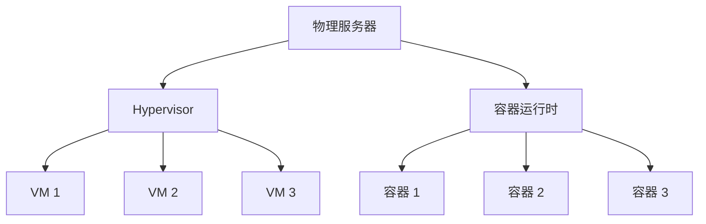

---
title: ☁️ 云计算：从基础设施到智能服务的演进之路
summary: 深入探讨云计算的核心概念、服务模型、关键技术及未来发展趋势，涵盖IaaS、PaaS、SaaS、Serverless与边缘计算等前沿方向。
date: 2026-06-04
authors:
  - Conan
tags:
  - Cloud Computing
  - IaaS
  - PaaS
  - SaaS
  - Serverless
  - Edge Computing
image:
  caption: "Image credit: [**Unsplash**](https://unsplash.com)"
---



## 引言

云计算（Cloud Computing）是21世纪最具变革性的信息技术之一。自2006年Amazon Web Services（AWS）推出弹性计算云（EC2）以来，云计算已从一种新兴技术范式发展为支撑全球数字经济的基础设施。根据Gartner的预测，全球公有云服务支出将持续增长，企业数字化转型的重心正加速向云端迁移。

云计算的核心理念是按需自助服务、广泛的网络接入、资源池化、快速弹性和可量测的服务。这些特性使得企业能够将资本支出（CapEx）转化为运营支出（OpEx），在降低IT成本的同时获得前所未有的敏捷性。

## 云计算的核心服务模型

云计算的服务模型通常分为三个层次，构成了业界常说的"云计算堆栈"：

### 基础设施即服务（IaaS）

IaaS提供虚拟化的计算资源，包括虚拟机、存储和网络。用户可以在此基础上部署和管理任意软件，而无需维护物理硬件。

- **代表产品**：AWS EC2、Microsoft Azure Virtual Machines、Google Compute Engine
- **核心能力**：弹性伸缩、按需付费、全球多区域部署
- **典型场景**：网站托管、大数据处理、灾难恢复

### 平台即服务（PaaS）

PaaS在IaaS之上提供了应用开发和部署的完整平台，包括运行时环境、数据库、中间件等。开发者可以专注于代码本身，无需关心底层基础设施。

- **代表产品**：Google App Engine、Heroku、Microsoft Azure App Service
- **核心能力**：自动伸缩、持续集成与部署、内置监控与日志
- **典型场景**：Web应用开发、API服务、微服务架构

### 软件即服务（SaaS）

SaaS通过互联网直接向用户交付完整的应用软件。用户通过浏览器或客户端即可使用，无需安装和维护。

- **代表产品**：Salesforce、Microsoft 365、Google Workspace
- **核心能力**：多租户架构、自动化更新、跨设备访问
- **典型场景**：企业协作、客户关系管理、办公自动化

## 关键技术支撑

### 虚拟化与容器化

虚拟化技术是云计算的基石。Hypervisor技术使得单个物理服务器可以运行多个相互隔离的虚拟机，极大提升了资源利用率。近年来，以Docker为代表的容器技术进一步推动了轻量级虚拟化的发展。

容器相比传统虚拟机具有更快的启动速度、更小的资源开销和更好的可移植性。Kubernetes作为容器编排的事实标准，已成为云原生架构的核心组件。

### 软件定义网络（SDN）

SDN通过将网络控制平面与数据转发平面分离，实现了网络的集中化管理和自动化配置。在云环境中，SDN使得虚拟私有云（VPC）、负载均衡和防火墙策略能够通过API动态配置，极大提升了网络的灵活性和安全性。

### 分布式存储

云存储系统如Amazon S3、Google Cloud Storage等采用分布式架构，通过数据分片、多副本和一致性协议（如Paxos、Raft）保证数据的高可用性和持久性。对象存储、块存储和文件存储三种范式分别满足不同场景的需求。

## Serverless与函数计算

Serverless（无服务器）计算是云计算的高级抽象形态。开发者只需编写函数代码并配置触发条件，云平台自动负责资源的分配、扩展和计费。AWS Lambda的推出标志着Serverless时代的到来。

- **核心优势**：零运维、自动弹性、按调用次数计费
- **局限性**：冷启动延迟、运行时间限制、供应商锁定风险
- **适用场景**：事件驱动的数据处理、Webhook处理、定时任务

## 边缘计算

随着物联网（IoT）和5G技术的普及，边缘计算成为云计算的延伸。边缘计算将计算和存储资源部署在靠近数据源的网络边缘，以降低延迟、节省带宽并提升数据隐私。

- **与云计算的关系**：云边协同——云端负责全局调度和模型训练，边缘端负责实时推理和本地决策
- **典型应用**：自动驾驶、工业物联网、智能零售

## 云计算的安全挑战

尽管云计算带来了诸多便利，安全问题始终是企业上云的首要顾虑。主要挑战包括：

1. **数据安全与隐私**：多租户环境下数据隔离的可靠性；跨境数据传输的合规性（如GDPR）
2. **身份与访问管理**：最小权限原则的落实、密钥管理、多因素认证
3. **供应链安全**：第三方依赖和云服务商的信任边界
4. **合规与审计**：满足行业监管要求（如SOC 2、ISO 27001）

云服务商通常采用责任共担模型：云服务商负责"云的安全"，客户负责"云中的安全"。

## 未来展望

### AI驱动的云服务

大语言模型（LLM）和生成式AI正在重塑云计算的产品形态。云厂商纷纷推出AI平台服务（如AWS SageMaker、Azure AI Foundry），将模型训练、推理和微调能力作为基础设施提供。

### 多云与混合云

越来越多的企业采用多云策略避免供应商锁定并增强韧性。混合云架构允许敏感数据留在私有数据中心，同时利用公有云的弹性资源。

### 绿色云计算

数据中心的能耗问题日益突出。头部云厂商已承诺碳中和目标，通过液冷散热、可再生能源采购和智能调度技术降低PUE（电源使用效率）。

## 结论

云计算已经从单纯的成本优化工具演进为驱动业务创新的战略平台。无论是初创企业还是跨国集团，云都提供了敏捷、可扩展且经济高效的技术基础。随着Serverless、边缘计算、AI融合等新范式的成熟，云计算将继续深刻改变软件构建和交付的方式。对于技术人员而言，深入理解云计算的核心原理和最佳实践，已成为不可或缺的核心素养。

---

## 参考文献

1. Armbrust, M. et al. "A View of Cloud Computing." *Communications of the ACM*, 2010.
2. Mell, P. & Grance, T. "The NIST Definition of Cloud Computing." NIST Special Publication 800-145, 2011.
3. Gartner. "Forecast: Public Cloud Services, Worldwide, 2022-2028." 2024.
4. Jonas, E. et al. "Cloud Programming Simplified: A Berkeley View on Serverless Computing." UC Berkeley, 2019.
5. Satyanarayanan, M. "The Emergence of Edge Computing." *IEEE Computer*, 2017.
